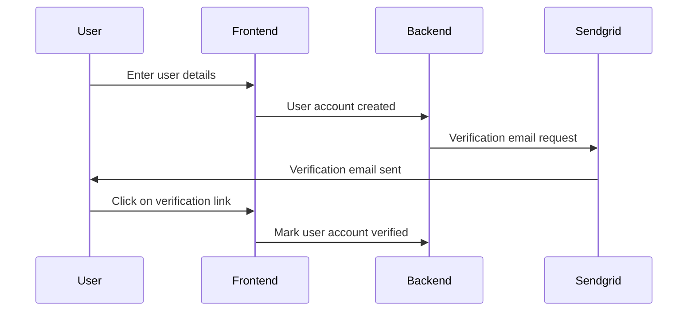
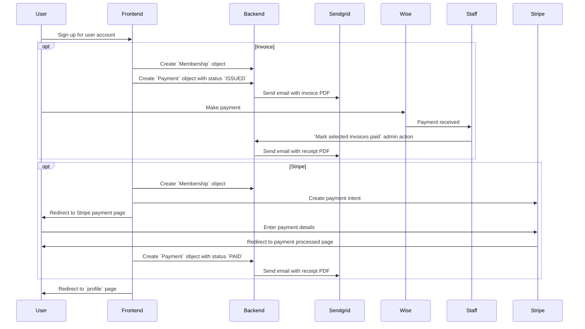

# dds_registration
A Django App to manage DdS membership and event registration.

[](https://pypi.org/project/django-dds_registration/)
[](https://pypi.org/project/django-dds_registration/)
[](https://github.com/gchazot/dds_registration/actions/workflows/run_tests.yml)

## User accounts

A user account is required for using the membership and events portal. User account emails must be verified. We use the built-in Django verification code.



## Membership

### Signing up for DdS membership

DdS membership runs per calendar year, from January 1st to December 31st. Signing up for DdS membership requires a valid user account.



## Development
The `dev_server.sh` script is here to help setting up a development site.

```shell script
./dev_server.sh run
```
This will start a local dev server running with its own virtualenv.

```shell script
./dev_server.sh test
```
This will run all the tests currently available in the codebase and provided by Django.

```shell script
./dev_server.sh --help
```
For more options the script has to offer.

## Releasing
#### Preparation
* Update `setup.cfg` with the new version number and commit
* Merge all desired changes to `master`
* Create a release in GitHub with a summary description, including creating a new tag v<version_number>.

#### Automatic release
[Github Actions](https://github.com/gchazot/dds_registration/actions) take care of everything.

#### Manual release process
A little more involved but it's Okay I guess
```shell script
rm -rf build/ dist/ django_dds_registration.egg-info/
python setup.py sdist
twine upload dist/*
```
