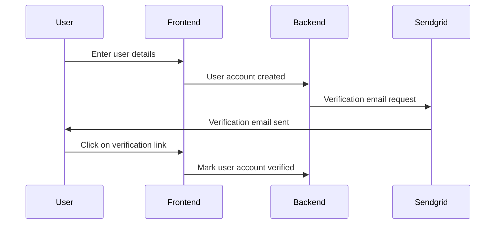
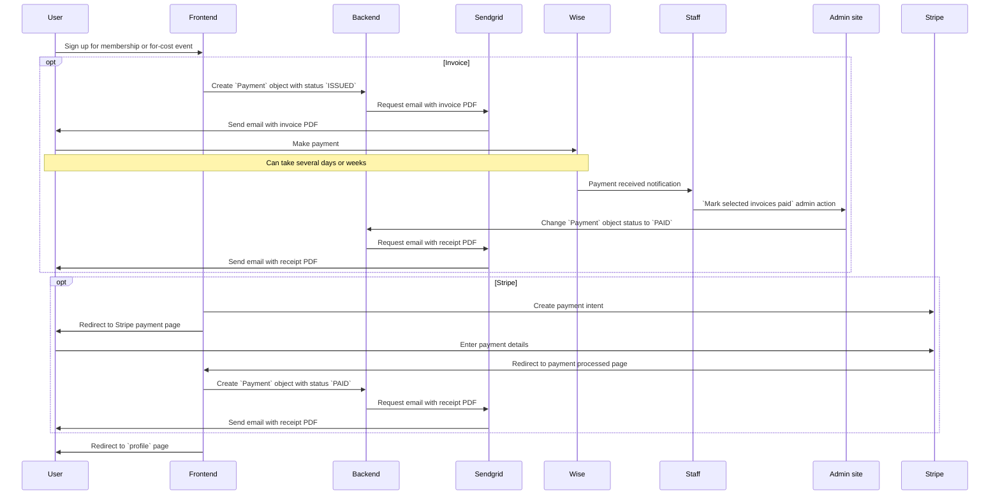
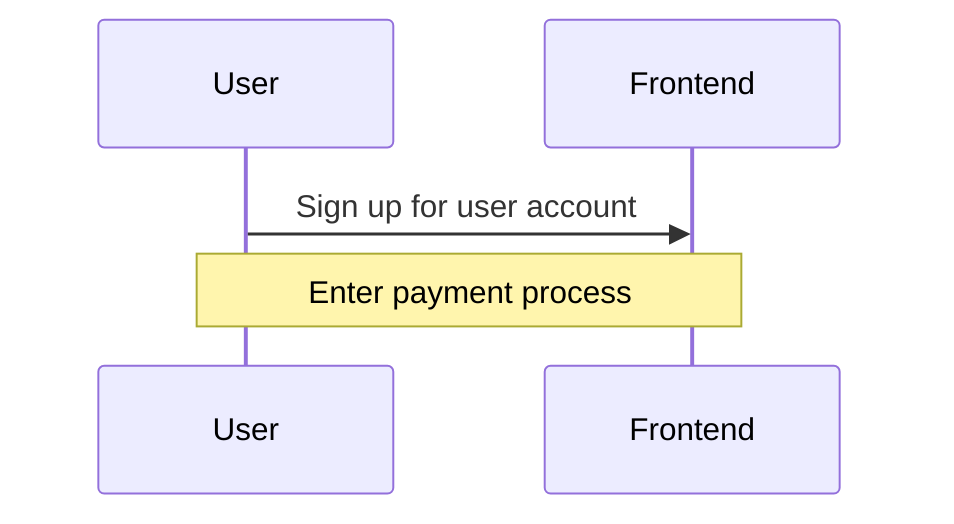
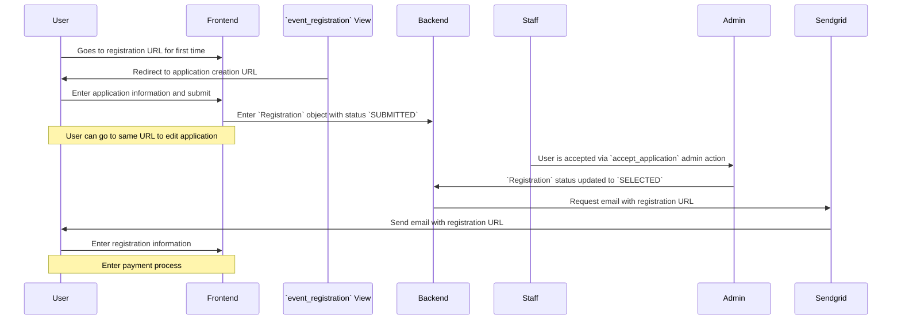

# dds_registration
A Django App to manage DdS membership and event registration.

[](https://pypi.org/project/django-dds_registration/)
[](https://pypi.org/project/django-dds_registration/)
[](https://github.com/gchazot/dds_registration/actions/workflows/run_tests.yml)

## User accounts

A user account is required for using the membership and events portal. User account emails must be verified. We use the built-in Django verification code.



## Payments

Users can chose to pay by invoice or by credit card (via Stripe) for an extra fee. The extra fee covers the money we lose to Stripe; the exact amount varies by currency, but is enough that we need to account for it.

All payments are processed the same way:



## Membership

DdS membership runs per calendar year, from January 1st to December 31st. Signing up for DdS membership requires a valid user account.



To give an honorary membership, ask the user to sign up for an invoice, and then delete the payment and set membership status to `HONORARY`.

## Event registration

### Events with applications

An event with an application requires people to apply, and some or all of the applicants can be selected. To create an event with an application, you need to have an admin account, and can then do the following:

First, [Create a new event](http://events.d-d-s.ch/admin/dds_registration/event/add/). You will need to fill in the event title and description (plain text for now), but also supply the following:

* Application submitted email: The email sent when users submit an application to join the event. This should thank them, let them know when they can expect a decision, and let them know that they can edit their answers at anytime. The URL to edit the application is shown at the bottom of the page ("Edit registration url").
* Application accepted email: The email sent when the application is accepted, and the user can actually register for the event and enter payment information (if required - skipped if the price is zero). The URL to register for the event is the same as the one to create or edit an applicaition - "Edit registration url" at the bottom of the page.
* Application rejected email: The email sent when an application was not accepted, due to space constraints or other reasons.
* Success email: The email sent when registration is successful. This should give instructions on what to expect, logistics, etc.

Next, if your event has a price, create at least one [registration option](http://events.d-d-s.ch/admin/dds_registration/registrationoption/add/), and associate it with the event. If your event is free, make *sure to check* `Free` in the `Event` admin page.

You then need to [create an application form](http://events.d-d-s.ch/applications/dashboard/). The graphical buttons are not always straightforward here, some experimentation is needed.

Finally, go back to the event admin page, and select the new application form for your event. If you want this event to be shown on the homepage, select `Public`; otherwise, you can email the registration link to people you want to invite.



## Development
The `dev_server.sh` script is here to help setting up a development site.

```shell script
./dev_server.sh run
```
This will start a local dev server running with its own virtualenv.

```shell script
./dev_server.sh test
```
This will run all the tests currently available in the codebase and provided by Django.

```shell script
./dev_server.sh --help
```
For more options the script has to offer.

## Releasing
#### Preparation
* Update `setup.cfg` with the new version number and commit
* Merge all desired changes to `master`
* Create a release in GitHub with a summary description, including creating a new tag v<version_number>.

#### Automatic release
[Github Actions](https://github.com/gchazot/dds_registration/actions) take care of everything.

#### Manual release process
A little more involved but it's Okay I guess
```shell script
rm -rf build/ dist/ django_dds_registration.egg-info/
python setup.py sdist
twine upload dist/*
```
